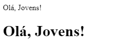

# Tutorial Progressivo — Construindo um Site de Flashcards  

Cada etapa acrescenta algo novo. Siga na ordem para chegar ao resultado final.

---

## 0 – Preparação do Ambiente

### Quando estou começando o projeto pela primeira vez

1. Criar uma pasta no computador, onde os arquivos que serão programados devem ser salvos. Por exemplo:

```bash
Documentos
└──── trabalho-flashcards
```

2. Abrir o VSCODE na pasta `trabalho-flashcards`, para que os arquivos possam ser carregados no VSCODE.

---

## 1 – Primeira Página HTML Mínima (`index.html`)

### O que é HTML?

HTML (HyperText Markup Language) é a linguagem de marcação usada para criar a estrutura de conteúdo de páginas web. As ``marcações`` funcionam como peças de um jogo de montar, em que cada peça indica ``algo`` para o navegador.

Por exemplo, existe a peça `h1`, que indica para o navegador que ele deve criar um título no site.

``` html
<h1> Olá, jovens!</h1>
```

No exemplo abaixo, a primeira frase foi feita **sem** a marcação `h1`. Já a segunda foi feita **com** `h1`



### O que é uma tag?

Uma tag é um pedacinho de código que define partes de uma página web. Tag é a forma como o HTML marca (ou “rotula”) um trecho de conteúdo para indicar qual é o seu papel no documento.
Ela diz ao navegador: “isto é um título”, “isto é uma imagem”, “isto é um link”, e assim por diante. Existem mais de 100 tags, as quais podem ser consultadas neste [endereço](https://www.w3schools.com/tags/).

#### 1. Anatomia de uma tag

``` html
<p class="destaque">Olá, mundo!</p>
```

| Parte              | Significado                                                            |
| ------------------ | ---------------------------------------------------------------------- |
| `<` & `>`          | Delimitadores que indicam o início e o fim da marcação                 |
| `p`                | **Nome da tag** (parágrafo)                                            |
| `class="destaque"` | **Atributo** que adiciona informação extra (aqui, uma classe para CSS) |
| `</p>`             | **Tag de fechamento** — encerra o alcance da marcação                  |


Lembre-se que o HTML utiliza ``tags`` para programação da estrutura do site. Geralmente, essas tags estão em pares. Por exemplo:

  * `<html lang="pt-BR">` e `</html>`
  * `<head>` e `</head>`
  * `<section id="container">` e `</section>`

Nesse sentido as tags podem ser dividas em dois grupos:

| Tipo                          | Exemplos                                       | Observação                                      |
| ----------------------------- | ---------------------------------------------- | ----------------------------------------------- |
| **Com abertura e fechamento** | `<h1>…</h1>`, `<div>…</div>`                   | Envolvem um conteúdo                            |
| **Auto‑fechamento (vazias)**  | ``, `<br>` | Não têm conteúdo interno; terminam nelas mesmas |

Essas tags possuem várias funções, dentre elas:

| Tag                                       | O que faz                     | Exemplo rápido                             |
| ----------------------------------------- | ----------------------------- | ------------------------------------------ |
| `<h1>` a `<h6>`                           | Títulos e subtítulos          | `<h2>Capítulo 1</h2>`                      |
| `<p>`                                     | Parágrafo de texto            | `<p>Texto corrido…</p>`                    |
| `<a>`                                     | Link                          | `<a href="https://exemplo.com">Visite</a>` |
| ``                                   | Imagem                        | ``     |
| `<ul>` / `<ol>` / `<li>`                  | Listas                        | `<ul><li>Item</li></ul>`                   |
| `<header>`, `<nav>`, `<main>`, `<footer>` | Estrutura semântica da página | Melhora SEO e acessibilidade               |

#### Hierarquia importa!

Em um documento HTML, as tags formam uma árvore (Document Object Model, ou DOM). Cada elemento é um nó que pode conter outros nós dentro dele. Entender essa hierarquia é essencial para estruturar corretamente a página, aplicar CSS com precisão e manipular o conteúdo via JavaScript.

``` html
<!-- isso é apenas um exemplo. não faz parte do projeto FLASHCARDS -->
<!DOCTYPE html>
<html lang="pt-BR">        <!-- nó‑raiz -->
  <head>                   <!-- filho de <html> -->
    <title>Título</title>  <!-- filho de <head> -->
  </head>

  <body>                   <!-- filho de <html> -->
    <header>               <!-- filho de <body> -->
      <h1>Meu Site</h1>    <!-- filho de <header> -->
    </header>

    <main>                 <!-- filho de <body> -->
      <section>            <!-- filho de <main> -->
        <article>          <!-- filho de <section> -->
          <h2>Assunto</h2> <!-- filho de <article> -->
          <p>Texto…</p>
        </article>
      </section>
    </main>
  </body>
</html>
```

1. html é a raiz, tudo está dentro dele.
1. head e body são irmãos (filhos diretos de html).
1. header, main, footer (se houver) são filhos de body.
1. E assim por diante — cada abertura/fechamento define um ramo da árvore.

#### Por que tags importam?

1. Semântica: ajudam máquinas (navegador, buscadores, leitores de tela) a entender o que é cada parte do documento.
1. Estilo: servem de ganchos para o CSS aplicar cores, tamanhos, layouts.
1. Interatividade: o JavaScript costuma “encontrar” elementos pelas tags (ou seus atributos) para reagir a cliques, animações etc.

#### Para lembrar

Uma tag é como um rótulo que você cola em volta de um conteúdo para dizer: **Isto é X e deve ser tratado como tal**. Sem elas, o navegador veria tudo como texto plano — e a web não teria nem estrutura, nem estilo, nem comportamento dinâmico.

#### Voltando ao código do projeto

Você deve criar o arquivo `index.html` na pasta que foi criada [acima](#0preparação-do-ambiente).

```bash
Documentos
└──── trabalho-flashcards
```

No exemplo acima, o arquivo deve ficar dentro da pasta `trabalho-flashcards`. No final deve ficar assim:

```bash
Documentos
├── trabalho-flashcards
└──── index.html
```

O código a seguir deverá estar no arquivo `index.html`
```html
<!-- código deve estar no index.html -->
<!DOCTYPE html>
<html lang="pt-BR">
  <head>
    <meta charset="utf-8">
    <title>Flashcards de Estudo</title>
  </head>
  <body>
    <main>
      <section id="container">
        <!-- a maior parte do código será colocado aqui -->
      </section>
    </main>
  </body>
</html>
```
*A página ainda está vazia: tudo pronto para receber estilo e cards.*

*`<!-- a maior parte do código será colocado aqui -->`* essa linha é um comentário. Podemos utilizar comentários para deixar mensagens que não aparecerão no site final, apenas pode ser vista por quem acessa o código.

---

## 2 – Variáveis e Reset no CSS (`style.css`)

### O que é CSS?

CSS (Folhas de Estilo em Cascata) é a linguagem de estilo usada para definir aparência e layout de páginas HTML. Enquanto o HTML estrutura o conteúdo (títulos, parágrafos, imagens), o CSS diz como esse conteúdo deve ser exibido: cores, tamanhos, fontes, posicionamento, animações e muito mais.

### Por que **Cascata**?

Imagine várias camadas de tinta escorrendo sobre um desenho:

1. Primeira demão: o navegador aplica os estilos padrão dele.
1. Segunda demão: vêm as regras do seu arquivo CSS.
1. Terceira demão: se o mesmo elemento recebe outro estilo mais específico (por classe, id ou style inline), ele “escorre” por cima e cobre o anterior.

Assim, quando dois estilos disputam o mesmo lugar, o navegador decide qual fica visível:

1. Mais específico vence (ID > classe > tag).
1. Em empate, o que foi lido por último fica por cima.

É como pintar sobre a mesma área: a cor aplicada depois (ou com pincel mais fino) cobre a anterior — por isso chamamos de Folhas de Estilo em Cascata.

### Qual a estrutura do CSS?

``` css
/* esse CSS não faz parte do projeto */

/* seletor */          /* valor */
p.destaque {
  /* propriedade */     /* valor */
  color:              #0d6efd;      /* texto azul */
  font-size:             1.2rem;   /* 1.2 × tamanho base */
  margin-bottom:         16px; /* espaçamento inferior */
}

/* Deixa todo parágrafo azul‑escuro */
p {
  color: #1e90ff;
}

/* Fundo amarelo e espaço interno extra
   para qualquer elemento com class="alerta" */
.alerta {
  background-color: yellow;
  padding: 8px;
}

/* Ajusta tamanho e deixa a logo redonda */
#logo {
  width: 120px;
  border-radius: 50%;
}
```

1. Seletor → quem será estilizado (p.destaque = parágrafo com classe destaque).
1. Propriedades → o que alterar (color, font-size, margin-bottom).
1. Valores → como alterar (#0d6efd, 1.2rem, 16px).

### Quais são os tipos de seletores?

| Tipo                | Exemplo         | Seleciona                            |
| ------------------- | --------------- | ------------------------------------ |
| **Tag**             | `h1`            | Todos os `<h1>`                      |
| **Classe**          | `.menu`         | Qualquer elemento com `class="menu"` |
| **ID**              | `#logo`         | Elemento único com `id="logo"`       |
| **Descendente**     | `nav a`         | `<a>` dentro de `<nav>`              |
| **Pseudo‑classe**   | `a:hover`       | Link ao passar o mouse               |
| **Pseudo‑elemento** | `p::first-line` | Primeira linha do parágrafo          |

### Para lembrar

CSS é o figurino da web: transforma o esqueleto HTML em uma experiência visual atraente, responsiva e acessível — tudo isso através de regras de estilo que “cascateiam” até chegar ao resultado final na tela do usuário.

- **HTML** cria o esqueleto  
- **CSS** veste o esqueleto (cores, fontes, posição)  
- **JavaScript** dá vida (cliques, animações)

### Voltando ao projeto

Para começar a programar a decoração do site, precisamos criar um arquivo específico para isso. Nesse projeto vamos criar uma pasta chamada `assets`, que em português significa ``recursos``. Dentro dessa parta, criamos o arquivo `style.css`. No final os arquivos devem ficar assim:

```
Documentos
└── trabalho-flashcards
    ├── assets              <- pasta de recursos
    │   └── style.css       <- arquivo de estilos
    └── index.html
```

O código a seguir deve estar no arquivo `style.css`.
```css
/* Paleta de cores reutilizável */
:root{

  /* > Pense em `:root` como a 🎨“caixinha de lápis”🎨 que define as principais cores do projeto.  
  > Se amanhã o tema mudar, basta trocar os lápis aqui — todas as páginas se recolorirão. */
  --text-color:#DBE4EF;
  --card-front:#144480;
  --card-back:#00F4BF;
}

body{
  margin:0;
  font-family:"Bai Jamjuree",sans-serif;
  background:#f5f7fa;          /* cor neutra de fundo */
}
```

#### Entendendo o código acima

1. `:root`: 
   * seletor que possui uma prioridade acima de todos os outros seletores. Ele permite declarar estilos que ficam disponíveis a página toda.
   * quando outro programador vê o seletor `:root`, ele sabe que ali tem código que será utilizado ao longo de todo css.
2. `--text-color`, `--card-front`, `--card-back`: são variáveis. Para entender o que é uma variável, imagine o seguinte:

        ``` text
        Imagine que você está pintando a sua casa:

        Em vez de anotar “Azul Pastel” em cada parede, porta e janela,
        você cola um post‑it na porta da sala escrito: “Cor das paredes = Azul Pastel”.

        Sempre que alguém perguntar “qual tinta usar aqui?”, basta olhar o post‑it.

        Se um dia você decidir trocar para “Verde Menta”, altera só o recado — e toda a casa sabe qual cor nova usar.
        ```
      No caso do css acima, os post-its (`--text-color`, `--card-front`, `--card-back`) guardam valores (``#DBE4EF``. `#144480`, `#00F4BF`) de cores. Quando quiser usar uma cor para o texto, vamos usar `--text-color` ao invés de usar diretamente ``#DBE4EF``.
---

### Para terminar a etapa 2

O arquivo css deve ser ligado com o arquivo html. Para isso, você deve usar a linha abaixo dentro da marcação `<head>`.

```html
<!-- a linha abaixo você deve colocar dentro do head do seu projeto. -->
<link rel="stylesheet" href="assets/style.css">
```

Exemplo final:

```html
<!-- código deve estar no index.html -->
<!DOCTYPE html>
<html lang="pt-BR">
  <head>        <!-- começo do head -->
    <meta charset="utf-8">
    <title>Flashcards de Estudo</title>
    <link rel="stylesheet" href="assets/style.css"> <!-- linha incluída aqui -->>
  </head>      <!-- fim do head -->
  <body>
    <main>
      <section id="container">
        <!-- a maior parte do código será colocado aqui -->
      </section>
    </main>
  </body>
</html>
```


## 3 – Layout do Container e Cartão

Agora vamos criar o “tabuleiro” onde ficarão os cartões.

### O que é Flexbox?

Flexbox é um modo de layout que distribui caixas numa linha ou coluna com facilidade, alinhando, centralizando e espaçando itens sem contas complicadas.

### Passo a passo

1. No vscode, abra o arquivo **assets/style.css** e adicione ao final:

```css
/* Área onde os flashcards aparecem */
#container{
  display:flex;             /* ativa o Flexbox */
  flex-wrap:wrap;           /* permite quebrar linha */
  gap:3rem;                 /* espaço entre cartões */
  padding:4rem;             /* espaço interno */
  justify-content:space-between;
}

/* Cada cartão ocupa 1/3 da largura em telas grandes */
.cartao{
  height:20rem;
  flex:1 0 calc(33% - 6rem); /* 3 por linha em telas grandes *//* largura flexível - espaçamento */
}
```
2. Salve, recarregue o navegador: nada aparece!! 🤯 🤯 🤯 Isso corre porque ainda não criamos os cartões, mas a “prateleira” já está montada 🧐.

---

## 4 – Estrutura de **um** Cartão Estático

### Por que começar com **um**?

Mexer em um único exemplar facilita enxergar erros antes de gerar dezenas.

1. No `index.html`, **dentro de** `<section id="container">`, coloque:

```html
<article class="cartao">
  <div class="cartao__conteudo">
    <h3>Programação</h3>
    <div class="cartao__conteudo__pergunta">
      <p>O que é JavaScript?</p>
    </div>
    <div class="cartao__conteudo__resposta">
      <p>JavaScript é uma linguagem de programação</p>
    </div>
  </div>
</article>
```

2. Volte ao `style.css` e acrescente:

Estilize o conteúdo:
```css

/* Conteúdo do cartão */
.cartao__conteudo{
  background:var(--card-front);
  text-align:center;
  height:100%;
  transform-style:preserve-3d;
  transition:transform .3s ease-in-out;
}

/* Título do cartão */
.cartao__conteudo h3{
  color:var(--text-color);
  border:1px solid var(--text-color);
  margin:.6rem;
  padding:.5rem;
  border-radius:.6rem;
  font-size:3vw;
  backface-visibility:hidden;
}

/* Pergunta do cartão */
.cartao__conteudo__pergunta p{
  color:var(--text-color);
  margin-top:4rem;
  font-size:3.8vw;
}
```
*`preserve-3d` mantém frente e verso; `backface-visibility:hidden` evita espelhamento.*

3. Salve e visualize: você deve ver um cartão azul com a pergunta.

> **Dica 👀**  
> Ajuste `font-size`, `margin-top` e `border-radius` para sentir como cada propriedade altera o visual.

---

## 5 – Efeito de Virar o Cartão

Queremos 🪄✨ clicar e revelar 🪄✨ a resposta.

```css
.cartao__conteudo__resposta{
  position:absolute;
  top:0;left:0;
  height:100%;width:100%;
  background:rgba(0,244,191,.2);
  border:4px solid var(--card-back);
  transform:rotateY(180deg); /* inicialmente “de costas” */
  backface-visibility:hidden;
  display:flex;align-items:center;justify-content:center;
  color:var(--card-back);
  font-weight:700;
}

.cartao.active .cartao__conteudo{
  transform:rotateY(180deg); /* gira quando .active é aplicado */
}
```
---

## 6 – JavaScript para Criar e Virar Cartões (`app.js`)

### O que é JavaScript (JS)?

**💭 Pense assim 🤔**
| Camada         | Papel                                      |
| -------------- | ------------------------------------------ |
| **HTML**       | O **esqueleto** (o que aparece na página). |
| **CSS**        | A **roupa** (cores, tamanhos, posição).    |
| **JavaScript** | O **cérebro** — faz tudo “se mexer”.       |


JS é uma linguagem de programação que roda dentro do navegador (Chrome, Firefox, Edge…).
Ele permite responder a ações do usuário (cliques, toques, teclas), alterar o HTML em tempo real, buscar dados na internet, tocar sons, animar objetos… sem recarregar a página.

### Como o navegador entende JS?

1. Você coloca um marcador ``<script>`` no seu html indicando um arquivo .js.
2. Quando o navegador chega nessa linha, ele lê e executa o código do arquivo.
3. Daí em diante, o JS pode:
   * Pegar elementos (document.getElementById);
   * Ouvir eventos (addEventListener);
   * Mudar texto, cor, classes, estilos (element.innerHTML, classList.add(), style.color = …).

**🤔 Analogia simples 💭**

Imagine que o HTML monta um boneco de papel.
O CSS pinta e dobra esse boneco para ficar bonito.
O JavaScript coloca fios e transforma o boneco num fantoche: agora ele reage quando você puxa um fio (clica) ou balança a mão (passa o mouse).

### Primeiros conceitos que aparecerão no código

| Conceito                | Para que serve                           | Mini‑exemplo                                    |
| ----------------------- | ---------------------------------------- | ----------------------------------------------- |
| **Função**              | Bloco de ações que você pode reutilizar. | `function mostrar() { alert("Oi!"); }`          |
| **Variável**            | Caixinha para guardar informação.        | `let pontos = 0;`                               |
| **Selecionar elemento** | “Pegue esse pedaço do HTML”.             | `const btn = document.querySelector("button");` |
| **Evento**              | “Quando acontecer X faça Y”.             | `btn.addEventListener("click", mostrar);`       |
| **Template string**     | HTML com `${variavel}` dentro            | `` `<p>${nome}</p>` ``                          |

### Mão na massa!

1. Criar um arquivo chamado ``app.js``, que deve ficar junto do arquivo ``index.html``. Depois de criar o arquivo ``app.js``, os seus arquivos devem ficar assim:

```
Documentos                  <- pasta Documentos
└── trabalho-flashcards     <- pasta principal do projeto
    ├── assets              <- pasta de recursos
        └── style.css       <- arquivo de estilos
    └── index.html          <- arquivo principal do html
    ├── app.js              <- **novo** arquivo para o código javascript
```

2. **Conceito rápido:👂“Ouvidos”👂 (Event Listeners)**

- O navegador **escuta** eventos (cliques, teclas, rolagem).  
- Dizemos: “quando clicar neste cartão, faça tal coisa”. Isso é chamado de **evento**.

3. Dentro do arquivo ``app.js``, escreva o código abaixo:

```js
// função criaCartao. um trecho de códigos que realiza uma função específica.
// neste caso, a função cria um carte novo na tela.
function criaCartao(categoria, pergunta, resposta){
  
  // 1. Acha o container
  const container = document.getElementById("container");
  
  // 2. Cria o artigo (HTML na memória)
  const cartao = document.createElement("article");
  cartao.className = "cartao";
  
  // 3. Insere o conteúdo interno usando template string
  cartao.innerHTML = `
    <div class="cartao__conteudo">
      <h3>${categoria}</h3>
      <div class="cartao__conteudo__pergunta"><p>${pergunta}</p></div>
      <div class="cartao__conteudo__resposta"><p>${resposta}</p></div>
    </div>`;

  // 4. Faz o cartão virar ao clique
  cartao.addEventListener("click", ()=>cartao.classList.toggle("active"));

  // 5. Coloca o cartão na tela
  container.appendChild(cartao);
}
```
> **Analogia LEGO 🧱**  
> `createElement` fabrica uma peça fora da construção; `appendChild` encaixa a peça no lugar certo.

Agora temos a função, mas ainda não a chamamos.
---

## 7 – Banco de Perguntas Separado (`perguntas.js`)

1. Crie um arquivo `perguntas.js`. Ele deve ficar junto dos arquivos ``app.js`` e `index.html`.

```
Documentos                  <- pasta Documentos
└── trabalho-flashcards     <- pasta principal do projeto
    ├── assets              <- pasta de recursos
        └── style.css       <- arquivo de estilos
    └── index.html          <- arquivo principal do html
    ├── app.js              <- arquivo para o código javascript
    ├── perguntas.js        <- **novo** arquivo para guardar as perguntas com as respostas
```

Nesse arquivo novo, escreva o código abaixo. Se quiser, pode mudar as perguntas e as respostas.

```js
criaCartao("Programação","O que é Python?","Python é uma linguagem de programação");
criaCartao("Geografia","Capital da França?","Paris");
criaCartao("Inglês","Como se diz oi?","Hi");
```

2. No **final** do `index.html`, logo antes de `</body>`, inclua:

No final de **index.html**:
```html
<script src="app.js"></script>
<script src="perguntas.js"></script>
```
3. Recarregue a página: agora há vários cartões que viram!

---

## 8 – Imagens de Fundo Responsivas

### Por que 3 tamanhos?

- **Desktop**: tela grande, imagem nítida.  
- **Tablet**: média resolução.  
- **Mobile**: arquivo mais leve para economizar dados.

1. Crie uma pasta `img/` dentro de `assets`.

```
Documentos                  
└── trabalho-flashcards     <- pasta principal do projeto
    ├── assets              <- pasta de recursos
        ├── img             <- pasta com as imagens        
        └── style.css       <- arquivo de estilos
    ├── index.html          
    ├── app.js              
    ├── perguntas.js        
```

Depois faça o download das imagens a partir dos links abaixo. Coloque `bg-desktop.webp`, `bg-tablet.webp`, `bg-mobile.webp` em **img/**.

* [bg-desktop.webp](../assets/img/bg-desktop.webp)
* [bg-mobile.webp](../assets/img/bg-mobile.webp)
* [bg-tablet.webp](../assets/img/bg-tablet.webp)

No final, os seus arquivos devem ficar algo assim:

```
Documentos                  
└── trabalho-flashcards     
    ├── assets              
        ├── img                   <- pasta com as imagens        
            ├── bg-desktop.webp   <- novo arquivo de imagem
            ├── bg-mobile.webp    <- novo arquivo de imagem
            └── bg-tablet.webp    <- novo arquivo de imagem
        └── style.css       
    ├── index.html          
    ├── app.js              
    ├── perguntas.js        
```

2. Agora, o arquivo ``style.css`` deve ser modificado para incluir as novas imagens. Abaixo, está os trechos de código que precisam fazer parte do arquivo ``style.css``.

```css
body{
  /* o seletor body já existe no seu código. você deve adicionar apenas a linha abaixo*/
  background:url('img/bg-desktop.webp') center/cover no-repeat fixed; 
}

/* abaixo existem dois grupos de código que não existem no css. voce pode escrever
ele completos.*/
/* tablet */
@media (max-width:1024px){
  body{ background:url('img/bg-tablet.webp') center/cover fixed; }
}
/* mobile */
@media (max-width:560px){
  body{ background:url('img/bg-mobile.webp') center/cover fixed; }
}
```

---

## 9 – Rodapé
1. Em `index.html`, logo após `</main>`:

```html
<footer>
  <p>Projeto desenvolvido pela turma – sem fins lucrativos</p>
</footer>
```

2. No `style.css`, acrescente:

```css
footer{
  background:#000;
  color:#fff;
  position:fixed;
  bottom:0; left:0;
  width:100%;
  height:2rem;
  display:flex;
  align-items:center;
  justify-content:center;
  font-size:.75rem;
}
```

> **Semântica**  
> A tag `<footer>` informa ao navegador e aos leitores de tela que esta seção contém o rodapé do documento.

## No final...

No final, os arquivos do seu projeto deve estar parecidos com esses arquivos:

1. [index.html](../index.html)
2. [app.js](../app.js)
3. [perguntas.js](../perguntas.js)
4. [style.css](../assets/style.css)